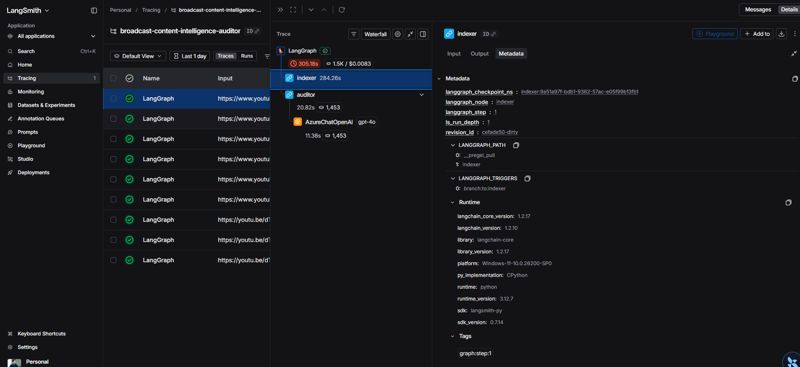

# Broadcast Content Intelligence Auditor

> **One slip in broadcast content can cost reputation, revenue, and regulatory fines.**  
> This system turns any video into a **professional, evidence-based audit report**—so you know exactly where you stand before you publish.

---

## Why This Exists

Broadcasters, brands, and platforms face a constant tension: **move fast** vs **stay compliant**. A single clip with inappropriate content, undisclosed sponsorships, or age-unsuitable material can trigger regulatory action, brand-safety fallout, platform takedowns, and loss of trust. Manual review doesn’t scale; simple “pass/fail” tools don’t give enough detail to act. What’s needed is **structured intelligence**: a clear risk score, evidence-backed findings, timestamps, and concrete recommendations—the kind of report an auditor would produce.

**Broadcast Content Intelligence Auditor** delivers exactly that: video in → one professional audit report out.

---

## What You Get

Every run produces a **single, detailed report** with:

| Section | Purpose |
|--------|----------|
| **Executive summary** | High-level narrative and main conclusions. |
| **Overall risk score** | 0–100 plus verdict: `LOW_RISK`, `MEDIUM_RISK`, `HIGH_RISK`, or `CRITICAL_RISK`. |
| **Final verdict** | Clear outcome (e.g. PASS/FAIL) for downstream systems. |
| **Age rating assessment** | Suitability for age groups, with evidence and findings. |
| **Brand safety assessment** | Alignment with brand guidelines; unsuitable or risky content. |
| **Harmful content assessment** | Hate speech, violence, harmful or sensitive content. |
| **Accessibility & distribution** | Accessibility and distribution suitability. |
| **Positive findings** | What the video did well (e.g. clear disclosures, appropriate tone). |
| **Flagged segments with timestamps** | Exact time ranges (start–end), category, severity, evidence, rationale. |
| **Recommendations** | Concrete next steps (e.g. cut segment, add disclaimer, change rating). |

The report is **evidence-based**: each finding ties back to transcript, OCR, labels, or other extracted data—auditable and defensible.

---

## Screenshots

### Audit Dashboard (Next.js)

The dashboard lets you paste a video URL, run an audit (sync or **async by default**), track status, and view the full report with risk score, verdict, section cards, evidence, recommendations, and export (TXT, JSON, PDF). Audit history is persisted and clickable for quick re-view.


### LangSmith – Workflow Observability

The pipeline is instrumented for observability. LangSmith gives you trace-level visibility into the LangGraph run: indexer and auditor steps, state transitions, and timings.



### Azure Application Insights – Dependencies & Performance

Application Insights tracks API requests, dependency calls (Video Indexer, OpenAI, Search, Storage), and performance. Use it to spot slow or failing dependencies and to correlate issues with specific audits.


---

## How It Works (Plain Language)

1. **You provide** a video (e.g. YouTube URL) and an identifier.
2. **The system** downloads the video and sends it to **Azure Video Indexer**, which produces structured data: speech, on-screen text, labels, keywords, brands, topics, faces, sentiment.
3. **That data** is combined with **your rules** (compliance docs, brand-safety guides) stored in **Azure AI Search**. The system retrieves the most relevant rules for the video.
4. **An AI auditor** (Azure OpenAI) reads the evidence and rules, then writes the full audit report in a fixed, structured format.
5. **You receive** one report: score, verdict, all sections, timestamps, and recommendations. Reports are also stored in **Azure Blob Storage** (date-partitioned paths) for compliance and reuse.

No manual tagging, no black-box “approved/not approved” only—you get a **document** you can file, share, or act on.

---

## Architecture

The pipeline is a **LangGraph** workflow: two nodes, shared state.

```
[START] → [Indexer] → [Auditor] → [END]
```

| Node | Responsibility |
|------|----------------|
| **Indexer** | Accepts `video_url` and `video_id`. Downloads the video (e.g. via yt-dlp), uploads to **Azure Video Indexer**, waits for processing, then extracts transcript, OCR, labels, keywords, brands, topics, faces, named people, sentiments, and metadata into shared state. |
| **Auditor** | Reads all extracted data, builds a RAG query, retrieves relevant regulatory/policy chunks from **Azure AI Search**, calls **Azure OpenAI** with a strict prompt for valid JSON, then builds the human-readable report (executive summary, risk score, verdict, all sections, flagged timestamps, recommendations) and persists to state and **Azure Blob Storage**. |

- **State:** `backend/src/graph/state.py` (`VideoAuditState`).
- **Graph:** `backend/src/graph/workflow.py`; node logic in `backend/src/graph/nodes.py`.
- **Storage:** Reports and full JSON results are written to Blob under `audit-reports/{YYYY/MM/DD}/{video_id}_report.txt` and `_result.json`.

---

## Tech Stack

| Layer | Technology |
|-------|------------|
| **Video ingestion & analysis** | yt-dlp, Azure Video Indexer |
| **Rules / RAG** | Azure AI Search, Azure OpenAI Embeddings |
| **Audit generation** | Azure OpenAI (chat), structured JSON → report |
| **Orchestration** | LangGraph (StateGraph, two nodes) |
| **API** | FastAPI (sync and async job endpoints) |
| **Frontend** | Next.js 16, React 19, TypeScript, Tailwind CSS |
| **Persistence** | Azure Blob Storage (reports + JSON), optional Application Insights |

---

## Project Structure

```
Broadcast-Content-Intelligence-Auditor/
├── .env                    # Configuration (Azure, OpenAI, Search, VI, Storage) — not committed
├── README.md
├── main.py                 # CLI entry point
├── pyproject.toml         # Python deps (uv/pip)
├── startup.sh              # One-time setup: dirs and placeholders
│
├── backend/
│   ├── data/              # PDFs and assets for the knowledge base
│   ├── scripts/
│   │   └── index_documents.py   # Index regulatory/policy docs into Azure AI Search
│   ├── src/
│   │   ├── api/
│   │   │   ├── server.py        # FastAPI: /health, /audit (sync + async jobs)
│   │   │   └── telemetry.py     # Azure Monitor / Application Insights
│   │   ├── graph/
│   │   │   ├── state.py         # VideoAuditState
│   │   │   ├── nodes.py         # index_video_node, audit_content_node, report builder
│   │   │   └── workflow.py      # create_graph(), LangGraph definition
│   │   └── services/
│   │       ├── video_indexer.py # Video Indexer: download, upload, wait, extract
│   │       └── report_storage.py# Blob: save_report_to_blob, save_result_json_to_blob
│   └── tests/
│
├── frontend/               # Next.js audit dashboard
│   ├── src/
│   │   ├── app/           # Dashboard & History pages
│   │   ├── components/    # UrlInput, StatusTracker, VideoPlayer, RiskVerdictCard, etc.
│   │   └── lib/           # API client, audit history (localStorage)
│   └── Images/            # Screenshots for README
│
└── azure_functions/
    └── function_app.py    # Azure Functions entry (e.g. HTTP trigger)
```

---

## Prerequisites

- **Python** 3.12+ (recommended: **uv** for installs and env).
- **Node.js** 20+ (for the Next.js frontend).
- **Azure** resources (all via `.env`):
  - **Video Indexer** (account, location, subscription, resource group).
  - **Azure OpenAI** (endpoint, API key, chat and embedding deployments).
  - **Azure AI Search** (endpoint, API key, index name) for RAG over rules.
  - **Azure Blob Storage** (connection string) for report and JSON persistence.
  - Optional: Application Insights for monitoring.

Regulatory/policy documents go in `backend/data/`; run `index_documents.py` once (or when docs change) to populate the search index.

---

## Configuration (`.env`)

Create or copy `.env` in the project root. Key variables:

- **Video Indexer:** `AZURE_VI_ACCOUNT_ID`, `AZURE_VI_LOCATION`, `AZURE_VI_NAME`, `AZURE_SUBSCRIPTION_ID`, `AZURE_RESOURCE_GROUP`
- **Azure OpenAI (chat):** `AZURE_OPENAI_ENDPOINT`, `AZURE_OPENAI_API_KEY`, `AZURE_OPENAI_API_VERSION`, `AZURE_OPENAI_CHAT_DEPLOYMENT`, `AZURE_OPENAI_EMBEDDING_DEPLOYMENT`
- **Azure OpenAI (embeddings, optional separate):** `AZURE_OPENAI_EMBEDDING_ENDPOINT`, `AZURE_OPENAI_EMBEDDING_API_KEY`, `AZURE_OPENAI_EMBEDDING_API_VERSION`, `AZURE_OPENAI_EMBEDDING_DEPLOYMENT`
- **Azure AI Search:** `AZURE_SEARCH_ENDPOINT`, `AZURE_SEARCH_API_KEY`, `AZURE_SEARCH_INDEX_NAME`
- **Blob Storage:** `AZURE_STORAGE_CONNECTION_STRING`

See `.env.example` or the repo for a full list. Never commit real `.env` (it’s in `.gitignore`).

---

## Setup and Run

### 1. Clone and install

```bash
# Backend
uv sync

# Frontend (from repo root)
cd frontend && npm install
```

### 2. Configure

Fill `.env` with your Azure and OpenAI settings.

### 3. Index your rules (one-time or when docs change)

```bash
uv run python backend/scripts/index_documents.py
```

This populates the Azure AI Search index used by the Auditor.

### 4. Run the workflow (CLI)

```bash
uv run python main.py
```

The CLI prints a single, fully formatted Broadcast Content Intelligence Audit Report for the configured `video_url`.

### 5. Run the API (FastAPI)

```bash
uv run uvicorn backend.src.api.server:app --reload
```

- **Base URL:** `http://localhost:8000`
- **Endpoints:**
  - `GET /health` – health check
  - `POST /audit` – sync audit: body `{"video_url": "<url>"}` → full `AuditResponse`
  - `POST /audit?async_mode=true` – async audit: returns `job_id`; poll `GET /audit/jobs/{job_id}/status` and `GET /audit/jobs/{job_id}/result`
- **Docs:** `http://localhost:8000/docs`

### 6. Run the audit dashboard

```bash
cd frontend && npm run dev
```

Open [http://localhost:3000](http://localhost:3000). The dashboard uses the API on port 8000; **Run in background (async)** is the default. Ensure the API is running when using the dashboard.

### 7. Optional: one-time layout

```bash
bash startup.sh
```

Creates expected directories and placeholder files if you start from an empty clone.

---

## Summary

- **Problem:** Broadcast and brand content need compliant, auditable decisions—not just a binary pass/fail.
- **Solution:** Broadcast Content Intelligence Auditor: video in → **one professional audit report** (risk score, verdict, age/brand/harm/accessibility, positive findings, **flagged timestamps**, recommendations), with optional persistence to Azure Blob and observability via LangSmith and Application Insights.
- **Workflow:** LangGraph with two steps: **Indexer** (download, Azure VI, extract) → **Auditor** (RAG over rules + LLM → structured report and Blob storage).
- **Audience:** Written for both **technical** (workflow, state, nodes, stack, API) and **non-technical** (problem, solution, what you get, plain-language “how it works”) readers.

Use the report to decide before publish, to document compliance, or to drive edits—with full transparency and evidence at every step.
